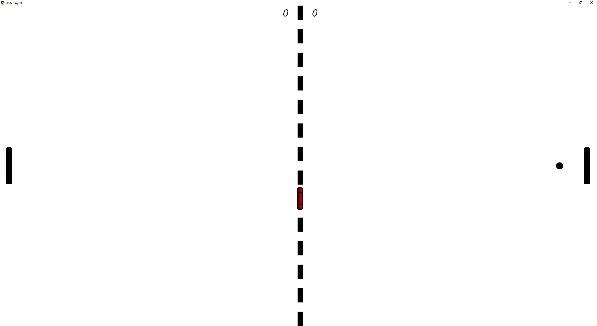

# Pong DirectX11.1

A DirectX 11.1 2D project created for my second term of my first year at The University of Huddersfield.

----------------------------------------------------------------------------------

This project was created using the skills I had obtained from my first project. It is a DirectX11.1 Pong game that has a main menu state, difficulty menu state and a play state.

Difficulty: As the difficulty level increases the middle puck becomes Bigger and faster.

Features:

- Two player.
- Game pad support.
- Score.
- Difficulty options.
- Menu.

----------------------------------------------------------------------------------

----------------------------------------------------------------------------------

NOTE: This project only supports game pad.